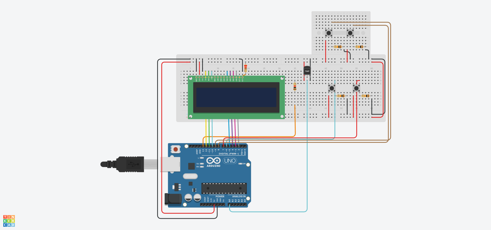

# 🧊 Zero Grau - Sensor de Temperatura para Freezer

Este projeto consiste em um sistema microcontrolado automatizado de controle e monitoramento de temperatura para freezers, projetado e validado inteiramente de forma digital através do simulador **Tinkercad**. O foco central do sistema é garantir o controle de qualidade na conservação de perecíveis em pequenos comércios e otimizar a eficiência energética do equipamento através de um algoritmo de termostato com histerese.

O projeto foi desenvolvido como parte das atividades de extensão acadêmica da **Universidade Estácio de Sá**, aliando conhecimentos de programação em C++ e arquitetura de sistemas embarcados a uma demanda real da comunidade.

## 🚀 Funcionalidades Atuais
*   **Monitoramento em Tempo Real:** Exibição contínua da temperatura atual do freezer e da meta configurada através de uma interface estável e sem oscilações visuais.
*   **Controle Inteligente de Refrigeração:** Acionamento automatizado do compressor baseado em um cálculo rigoroso de histerese para reduzir o consumo de energia elétrica.
*   **Ajuste Manual de Setpoint:** Botões dedicados para aumentar ou diminuir a temperatura alvo com resposta rápida.
*   **Modo Standby via Software:** Chaves exclusivas para ligar e desligar o compressor de forma segura para manutenções ou higienizações rápidas do freezer.
*   **Persistência de Dados Garantida:** Gravação condicional inteligente na memória EEPROM, que protege a vida útil do hardware e preserva os ajustes do usuário mesmo após quedas de energia.

## 🛠️ Arquitetura do Circuito (Tinkercad)
Abaixo constam todos os itens que estruturam o hardware simulado do projeto:
*   **U1:** 1x Arduino Uno R3 — Unidade central de processamento e execução estável do firmware.
*   **U2:** 1x LCD 16 x 2 — Tela de exibição que atua como Interface Homem-Máquina (IHM).
*   **U3:** 1x Sensor de temperatura [TMP36] — Transdutor analógico para leitura térmica em tempo real do freezer.
*   **S1, S2, S3, S4:** 4x Botões — Chaves tácteis para entrada de comandos do usuário (Meta e Estado).
*   **R1:** 1x Resistor de 1 kΩ — Resistor aplicado à linha de ajuste do display.
*   **R2, R3, R4, R5:** 4x Resistor de 10 kΩ — Resistores de acoplamento elétrico para estabilização de leitura das chaves tácteis.
*   **R6:** 1x Resistor de 220 Ω — Resistor limitador de corrente para proteção do LED de luz de fundo do LCD.

### 📌 Mapeamento de Pinos Utilizado
*   **Display LCD:** Pinos `12, 11, 5, 4, 3, 2` (Conexão padrão de 4 bits para os pinos RS, E, D4, D5, D6, D7).
*   **Sensor de Temperatura:** Pino Analógico `A1`.
*   **Atuador (Compressor):** Pino Digital `13` (Controla a refrigeração do sistema).
*   **Controle de Temperatura:** Pino `7` (Aumentar Meta) e Pino `6` (Diminuir Meta).
*   **Controle de Estado:** Pino `8` (Power ON) e Pino `9` (Standby / OFF).

---

## 💻 Lógica de Controle e Engenharia do Software

### 1. Equação do Sensor de Temperatura
O sinal de tensão recebido na porta analógica `A1` é decodificado e convertido em graus Celsius em tempo real através da equação linear ajustada para o sensor TMP36:
$$\text{Temp} = (\text{Voltagem} - 0.5) \times 100$$

### 2. Algoritmo de Histerese (Eficiência Energética)
Para evitar o estresse mecânico do compressor (acionamentos sucessivos por ruídos de leitura) e eliminar o desperdício de eletricidade, o motor opera sob limites térmicos protegidos com uma margem fixa de 3°C:
*   Se $Temp \ge Setpoint + 3°C$ ➡️ **Ativa Refrigeração `[REF]`** (Pino 13 em `HIGH`)
*   Se $Temp \le Setpoint$ ➡️ **Desliga Compressor `[OK]`** (Pino 13 em `LOW`)

### 3. Interface Homem-Máquina (IHM)
*   **Modo Ativo:** Exibe as leituras de temperatura real, meta definida e o estado dinâmico do motor (`[REF]` ou `[OK]`).
*   **Modo Standby:** Acionado ao pressionar o botão do pino 9. Desliga imediatamente o motor e exibe uma mensagem estática de `STATUS: OFF`, suspendendo o processamento do sensor para segurança do usuário.

---

## 🔧 Como Visualizar e Testar o Projeto

1. Acesse o ambiente do **Tinkercad**.
2. Monte o circuito elétrico seguindo as pinagens detalhadas no mapa de pinos deste documento.
3. Insira o código-fonte desenvolvido no bloco de programação de texto da plataforma.
4. Clique em **Iniciar Simulação**.
5. Utilize os botões para interagir com o sistema, alterar a temperatura desejada ou colocar o freezer em Standby.

## 👥 Integrantes do Grupo
*   Davi Carvalho
*   Gleison Pinto
*   João Silva
*   Luis Silva
*   Thaynná Rodrigues

---
🎨 *Projeto desenvolvido e simulado utilizando a plataforma Tinkercad.*

  

